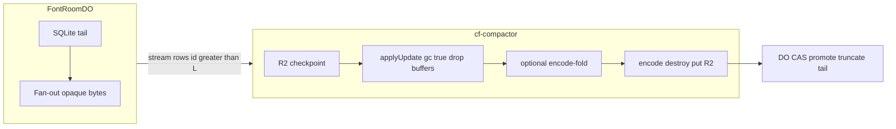

# Memory-efficient rooms, compact, nested JSON, and font-deps

## Peak we are designing for

Live DO: sockets + SQLite tail + one in-flight packet. No long-lived `Y.Doc`.

Worker compact: `gc: true` doc + one encoded snapshot + one packet. Never checkpoint + merged tail + live `gc: false` graph at once.

Fat-host compact stays a later `413` door ([cf-compactor/src/index.js](cf-compactor/src/index.js) already rejects over `MAX_COMPACTION_RECOVERABLE_BYTES`). Do not implement the host now; do not fall back to in-room encode on 413.




---

## 1. Nested JSON: getters and setters (full object-model walk)

Two mechanisms today:

- `getLiveMutableValue` — nested `set`/`delete` records the **whole property** ([babelfont-model.ts](webapp/js/babelfont-model.ts) ~3944). Used by almost every dict getter.
- `getPreciseLiveMutableValue` — records the **leaf path** (~4053). Used only by `Font.features` get.
- Dict **setters** all `recordAndMarkDirty(this, prop, old, value)` then `setYPath` does `current.set(lastKey, toYType(value))` (~1380), replacing the subtree.
- `mergeYMapContents` (~351) already deep-merges maps but is **additive** (does not delete missing keys) and is not used for these setters.

**Do not** special-case RTL. One rule: nested JSON is leaf-granular on **get and set**.

**Getters:** make `getLiveMutableValue` record leaf paths like the precise proxy (or replace all dict getters with it). `font.features.classes["vowels"].code = …` and `format_specific[k][master][a][b] = n` are one item.

**Setters:** assigning a dict must **symmetric-diff** into the existing Y.Map, never `toYType` the whole value. Use one write funnel: model recording, `setYPath`, `PatchSyncEngine._replaceYMapContents`, layer deltas, undo, and Python whole-object setters all call the same recursive replace-map implementation (set **and delete**). Do not leave a second additive-only `mergeYMapContents` path.

Arrays need semantic treatment rather than a generic index diff:

- Unordered membership (kern groups, codepoints): Y.Map/set keys.
- Ordered identifiable objects (feature entries, anchors, guides): stable ID → Y.Map plus an order Y.Array; IDs may be Y.Doc-only metadata. Outline topology uses the stricter atomic schema below.
- Primitive/arbitrary plugin arrays: mutate the existing Y.Array/LCS; never replace it merely because a parent setter ran.
- An index is only a UI lookup. A committed operation targets the observed Yjs item/stable ID so a concurrent insert cannot retarget it.

Helpers that clone-and-reassign a parent (`syncKerningRtlToFormatSpecific` ~12789, `setFormatSpecificKey` / `ensureModelFormatSpecific`) go through leaf records or this diff, never a parent snapshot.

### Outline schema: granular positions, atomic topology

The whole-shapes containment was deliberate: numeric writes such as `shapes/0/nodes` converged in browser Yjs but could append duplicate parent shapes in Rust/Yrs. Do not restore nested numeric shape/node writes.

Normalize each layer into two independent concerns:

```text
layer.geometryTopology       one versioned atomic scalar/blob
  generation
  ordered shape IDs
  per-path ordered node IDs
  node type, smooth, closed, and other topology-bearing fields

layer.nodePositionsById      Y.Map<nodeUUID, packedXY>
layer.shapeDataById          Y.Map<shapeUUID, non-topology shape data>
```

- Shape and node UUIDs are stable Y.Doc/runtime identity and are stripped only at external source boundaries.
- `packedXY` is one scalar pair (for example two f64 values), not nested `x` and `y` Items. A drag writes `nodePositionsById.set(nodeId, packedXY)`, producing one small packet and one coherent LWW position if two users drag the same node.
- Specify topology/position encodings with cross-language golden vectors; reject wrong lengths, non-finite coordinates, duplicate IDs, and unknown versions before model/cache adoption.
- Different-node coordinate edits merge independently. A coordinate edit survives a concurrent structural edit whenever the winning topology still references that node ID.
- Insert/delete, connect/split, open/close, reverse, set-start, node-type conversion, and any operation that can affect path grammar replace the complete **layer topology value** in one Yjs transaction. The transaction also adds/removes affected position and shape-data entries.
- Concurrent structural operations therefore choose one complete topology value through Y.Map conflict resolution; their orders cannot interleave into malformed contours. Removed-node coordinate writes are harmless orphans because topology is the only membership authority; an idempotent client repair pass deletes unreferenced entries.
- `smooth` remains in topology unless tests prove it cannot participate in path validity. Optimize only high-frequency `x/y` first.
- If one local batch changes topology, suppress obsolete buffered position writes for removed IDs. Undo/redo tracks the topology replacement and accompanying position-map changes as one history transaction.

The topology representation is a versioned non-shared scalar (compact JSON versus `Uint8Array` chosen by the capacity bench), not a nested Y.Array/Y.Map tree. Structural packets still carry whole topology metadata, but not every node coordinate or unrelated layer field.

### Strict reconstruction boundary

Browser and Rust independently reconstruct ordinary ordered Babelfont `shapes` from the same topology + position map after a complete Yjs transaction. Rust must never mutate a numeric parent array and must:

1. reject duplicate/missing shape IDs and duplicate/missing node references;
2. reject unknown topology versions and malformed path grammar;
3. stop silently skipping stale order entries;
4. preserve the last known-good compiler cache when reconstruction fails; and
5. assert reconstructed shape/node counts in browser↔Rust integration tests.

Update [developer-docs/YDOC_SHAPE_IDENTITY_MIGRATION.md](developer-docs/YDOC_SHAPE_IDENTITY_MIGRATION.md) to supersede its `shapesById + shapeOrder + nested nodes` target with this normalized schema. Migration is atomic per document version; flat and normalized outline representations are never simultaneous authorities.

### Inventory (memory impact)

**Must deep-diff (large or unbounded, often in font-core)**


| Field                                                                                                             | Get         | Set today     | Why                                                                              |
| ----------------------------------------------------------------------------------------------------------------- | ----------- | ------------- | -------------------------------------------------------------------------------- |
| `Font.format_specific` and the same field on Master, Glyph, Layer, Path, Component, Anchor, Guide, Axis, Instance | coarse live | whole replace | RTL kerning, Glyphs userData, cloud catalog (until moved), arbitrary plugin JSON |
| `Font.features`                                                                                                   | **precise** | whole replace | AFDKO classes/prefixes/feature list; setter is the hole                          |
| `Master.kerning` / `kerning_rtl`                                                                                  | coarse live | whole replace | pair tables                                                                      |
| `Font.first_kern_groups` / `second_kern_groups`                                                                   | coarse live | whole replace | group → glyph-name lists                                                         |
| `Font.variation_sequences`                                                                                        | coarse live | whole replace | nested selector → unicode → name; CJK-scale                                      |
| `Font.custom_ot_values` / `Master.custom_ot_values`                                                               | coarse live | whole replace | nested OT overrides                                                              |
| `Master.metrics`                                                                                                  | coarse live | whole replace | modest dict; same rule                                                           |
| `Font.names`, `Axis.name`, `Master.name`, `Instance.name` / `custom_names`                                        | coarse live | whole replace | i18n dicts; small but same rule                                                  |
| `Component.transform` / `location`, `Layer.location`, `Instance.location`, `Guide.pos` / `color`                  | coarse live | whole replace | small dicts; same rule so Python `obj.foo = {…}` is safe                         |


**Arrays / collections — break up if a single-element edit still replaces the container**


| Field                                      | Today                                                                                                                | Plan                                       |
| ------------------------------------------ | -------------------------------------------------------------------------------------------------------------------- | ------------------------------------------ |
| `features.features` (`[tag, code_dict][]`) | nested via precise get; setter replaces all                                                                          | stable entry id + order; `code` is a leaf |
| Kern group **values** (`string[]`)         | membership via coarse get = whole group map                                                                          | set-map membership; order is irrelevant |
| `Glyph.codepoints`                         | coarse live / whole-array set                                                                                        | set-map membership |
| `Axis.map` (avar pairs), `Axis.values`     | coarse / whole array                                                                                                 | small; same array-diff if cheap            |
| `glyphOrder`                               | `replaceYArrayOrder` / LCS already                                                                                   | keep                                       |
| Anchors/guides                             | indexed-map + `*Order` LCS                                                                                           | keep                                       |
| `Layer.shapes` / order                     | flat whole-array containment                                                                                        | atomic topology scalar + stable shape data |
| `applyLayerDelta` `**shapes**`             | `layerMap.set('shapes', toYType(value))` whole array ([change-bridge-ydoc.ts](webapp/js/change-bridge-ydoc.ts) ~261) | reconstruct topology + position/shape maps; no numeric child writes |
| `Path.nodes` / `Node.x|y`                  | `recordGranularNodesChange` then `setYPath` replaces the entire nodes array | one packed position scalar keyed by node UUID |
| Node order/type/smooth/closed               | embedded in whole shapes array                                                                                       | one atomic layer-topology replacement |


**Fine as primitives / rare structural replace**

- Scalars: `upm`, `date`, `exported`, `width`, `closed`, `reference`, axis min/max/default, etc.
- `Font.axes` / `masters` / `instances` **collection** setters: read-only views; structural add/remove APIs. Whole-array assign is rare; if kept, should still per-element merge by id, not one `toYType` of every master including kerning.
- `Font.note` / `source`: strings.

**Tests:** getter leaf writes; whole-object setters with one nested change; two writers editing different/same nodes; same-node x/y remains one coherent pair; coordinate-vs-reverse/delete/split preserves surviving IDs and ignores removed orphans; concurrent structural edits select one valid topology; undo/redo restores topology and coordinates; malformed/duplicate/missing IDs fail without replacing the last good Rust cache. Two sequential sidebearing-driven path updates must never increase Rust shape count. Measure update bytes, Item/struct count, topology-packet size, and `gc:false` undo retention.

---

## 2. Two shards: lean `font-core` + compact `font-deps`

This is required, not optional. Today the editor already has a `font-deps` Y.Doc, but `applyCloudOwnedData` still **embeds `fontDeps` inside core** `format_specific['com.counterpunch.cloud']` and `syncCloudOwnedProjection` dual-writes the whole map ([cloud-plugin.ts](webapp/js/filesystem-plugins/plugins/cloud-plugin.ts) ~1963, [patch-sync-engine.ts](webapp/js/patch-sync-engine.ts) ~1115). That is why Kaffeesatz core was ~84% cloud blob.

**Contract**

- `font-core`: font-wide fields, lean catalog + cmap (`Y.Map` by stable **glyphId**), display `glyphOrder`. **No** dependency edges.
- `font-deps`: one Y.Doc, one DO, own R2 checkpoint / tail / compact. Hydrate HTTP at open (already); live WS only if we need instant closure (v1 can stay HTTP + catch-up).
- `stripOwnedFontData` strips catalog from JSON on Save As; deps never lived in that JSON.

### Dependency identity and convergence

`buildFontDepsIndex` already unions components and metrics keys. Keep one graph, with edge kind `component | metrics-key | both`.

**Do not persist glyph-order indices, dense ranks, or one packed LWW adjacency blob.** Core and deps are separate Y.Docs/DOs: concurrent glyph creation can assign incompatible ranks, and concurrent edits to one source glyph can make a packed row lose an edge after the glyph shard itself converges.

Authoritative live format:

```text
deps.edges: Y.Map<sourceGlyphUUID, Y.Map<targetGlyphUUID, edgeKind>>
deps.sourceRevision: Y.Map<sourceGlyphUUID, glyphRevisionToken>
```

- Immutable glyph UUIDs are the only durable identity. Omit empty source maps. No reverse graph is stored.
- Per-edge CRDT keys preserve concurrent additions/deletions. A repair pass from the converged glyph shard removes conservative stale extras.
- `sourceRevision` is equality-only (current tokens are not ordered). A loaded glyph whose deps revision differs is recomputed with a symmetric per-edge diff.
- Ranks may be derived transiently for an HTTP pack, but never written into a Y.Doc or relied on across shards. Benchmark the UUID edge map honestly; Item count is the correctness cost.

**Builder:** remove `CloudPlugin._syncCatalogFromCommittedChange → initFromFontJson`; it currently rebuilds every glyph Y.Doc and can stomp in-flight state. Patch only one catalog/cmap entry and one source edge map. Narrow both `catalogNeedsUpdate` and `depsNeedUpdate`: component add/remove/reference and metrics-key fields only; not arbitrary `layers`, nodes, or `format_specific`. Parse metrics-key grammar rather than scanning all glyph names.

**Freshness:** deps is a denormalized projection; glyph shards are authoritative. A glyph update is durable first, deps edge diff second, core `glyphRevisions` signal last. On catch-up, recompute deps from the merged glyph body; stale extra edges may temporarily over-hydrate. Sparse hydration verifies each newly loaded source glyph against its deps revision, repairs missing edges, and repeats hydration to a fixed point, so projection lag cannot omit a final prerequisite. `font-deps` catches up on remote revision change, not only reconnect.

### Sparse hydration subset (graph sufficiency)

Compile today is `seeds → close_layout → expand_closure_with_component_deps` ([babelfont-fontc-build/src/lib.rs](babelfont-fontc-build/src/lib.rs) ~2239): **GSUB + upstream components only**. Architecture “Full downloadable closure” is the same (A then B as **prerequisites**). Downstream composites of “a” are not in the compile subset.

Sparse hydration for a user-chosen UI seed set:

```text
seeds            = glyphs the user picked
layout           = close_layout(seeds)     // core features + catalog names; no glyph bodies
dependents       = reverse*(seeds)         // invert forward edge maps in memory
hydrate          = forward*(seeds ∪ layout ∪ dependents)
```

Do **not** `close_layout` the reverse set (explodes). OT stays on user-chosen seeds only.

**Forward-close after reverse is required** (`ä` needs `dieresis` as well as `a`).

**Verdict:** the forward UUID edge set is sufficient. Metrics-key edges stay in the graph; OT stays in `close_layout`, not `font-deps`. Invert once in memory. Existing `collectComponentDependentGlyphs` remains valid inside the hydrated set.

---

## 3. Durable Object: opaque byte log (no Yjs graph)

[font-room-do.js](collab/collab/src/font-room-do.js) is one class for **core, deps, and every glyph room**. The same spikes hit a 30-byte node edit and a 10 MB core packet.

Target: bounded sockets/attachments + SQLite metadata + **one decoded frame**. No Yjs import or graph in the DO bundle. Empty room = no SQLite checkpoint pointer and `lastLogId === 0`.

### Auth, shard, and quota boundary

- Production tokens require an explicit monotonic `accessEpoch`; epoch 0/absent cannot bypass a room whose current epoch is newer. Website advances it on revoke/remove/delete and the room closes stale sockets.
- Before auth, accept only `auth`; cap concurrent and idle unauthenticated sockets. After auth, role/epoch/user come only from the hibernation attachment; viewers cannot write.
- Validate canonical room IDs and shard namespaces (`font-core`, `font-deps`, `glyph:<UUID>`). An asset token must not create unlimited arbitrary shard names. Seed/create is checked against the **asset owner’s** Website-D1 entitlement and a signed/authorized shard manifest; never collaborator entitlement.
- Internal manifest/export/promote/adopt routes require service-binding authentication with a scoped secret/JWT, not a caller-supplied marker header alone. Strip internal headers at the public edge.
- Bound peer count, attachment size, metadata envelope size, completed-update rate per user, incomplete transaction count, SQLite spool bytes, dirty rows, and dirty bytes. Admission also enforces `checkpointBytes + committedDirtyBytes + spooledBytes + incomingBytes` below a conservative effective shard budget (`min(10MB, bench-derived safe ceiling)` with framing headroom), so zero-hydration cannot bypass the encoded-document limit.

### Hibernation-safe ingress and validation

Removing `validateYjsUpdate` from the DO without replacement would let a broken/malicious editor poison peers and compaction. Move validation out of the room:

1. DO checks auth, wire types, base64/frame bytes, chunk count, declared/actual transaction bytes, metadata bytes, and quotas.
2. Decode **one frame** and insert it into `ingress_spool` (`committed=0`) keyed by server-issued connection ID + client sequence + transaction UUID. No in-memory chunk maps; SQL detects complete indices. TTL removes abandoned spools after hibernation.
3. Persist spool state (`pending|validating|valid|rejected`), attempt lease, and receive order. Serialize validation per room/source order. A separate internal validator Worker streams one completed transaction, assembles at most the bench-derived packet cap, applies it to a throwaway `{gc:true}` Y.Doc, destroys it, and calls back with digest/size. OOM/timeout expires the lease for bounded retry; it is never ACK.
4. On success, one `transactionSync` marks/inserts all chunks in `room_log`, updates counters, removes spool state. Only **after commit**: ACK and fan-out. On failure: delete spool, error/close; no durable tail and no peer exposure.
5. Duplicate transaction/chunk and validator-callback retries are idempotent; conflicting descriptors are rejected. Preserve per-client sequence and transaction-boundary order even after hibernation. If the origin socket vanished, commit remains durable; retry returns the ACK.

The validator proves Yjs syntax/decodability, not font schema or benevolent edits. Schema guards remain in clients/Rust. The packet/decoded-struct cap protects the validator; it may need to be **below** the 10MB shard cap.

### Checkpoint-relative join/reconnect

One `checkpointLogId` is insufficient after compaction. Track:

- `baselineCheckpointLogId`: baseline the client fetched/applied.
- `appliedLogId`: highest **contiguous committed** room-log ID the client applied (fan-out and replay include log IDs).

Server rules:

- If `appliedLogId < currentCheckpointLogId`, return `rebaseline-required`; those missing rows were truncated into the newer checkpoint.
- If `currentCheckpointLogId <= appliedLogId <= lastLogId`, replay `id > appliedLogId` page/frame-wise.
- Reject impossible future IDs; never silently clamp them.
- Omit server state vector. Client computes its vector after applying checkpoint + tail, then sends its local diff. A client may advance its baseline token after learning a promoted checkpoint `H` only if its contiguous `appliedLogId >= H`.

Cold `/live` pins checkpoint `L` and tail high-water `H`; if compaction advances past the client before WS join, rebaseline and retry. Reconnect with a retained hydrated Y.Doc sends both IDs; never clear them merely because the socket closed.

### Remove all hidden hydration

- `adopt-baseline` stores pointer/metadata only; seed bytes stay in R2.
- `/status`, `/log`, `/control` are SQLite metadata only; remove `_getDocDebugSummary`.
- No `_ensureDocLoaded`, `_checkpointToR2`, `validateYjsUpdate`, server state-vector generation, or local compact fallback.

---

## 4. When we compact; then how (paged tail + Worker GC)

Keep current trigger shape, then replace constants from §5 measurements:

**Do compact** (external Worker only; one in flight; `dirtyRowCount > 0`):

- Dirty **≥ 8 MB** (`CHECKPOINT_DELTA_BYTES_THRESHOLD`) → alarm in ~1 s
- Dirty **≥ 2000** tail rows (`CHECKPOINT_DELTA_ROWS_THRESHOLD`) → alarm in ~1 s
- Dirty age **≥ 30 min** (`MAX_CHECKPOINT_INTERVAL_MS`, measured from persisted `firstDirtyAt`) → safety alarm even under continuous low-volume writes
- Transient failure → exponential backoff with jitter. A **413 is terminal for this Worker tier**: do not retry every 60 seconds; mark `needs-fat-compactor` and protect the tail.

### Operator index and recovery

You cannot scan Durable Object SQLite or R2 to find these shards. On 413 and on `tail_full`, the room updates local `room_state` **and** upserts Website D1 via the existing internal service-token API:

```text
font_shard_ops (
  asset_id, shard_id, status,  -- needs-fat-compactor | tail_full
  checkpoint_bytes, dirty_bytes, last_log_id, marked_at, detail
)
```

**Find them:** `GET /api/internal/cloud/shard-ops?status=needs-fat-compactor` (same D1 as `font_assets`). Website admin/docs can list the same rows. That query is the work queue.

**While marked (this milestone, no fat-host yet):**

- Keep the tail. Never drop acknowledged updates. Never in-room encode.
- `needs-fat-compactor` alone: still readable; live WS and `/live` continue. New writes stay allowed until the hard dirty cap.
- `tail_full`: read-only. Writes get `503 tail_full`. Alarm does not keep calling Worker compact.
- Editor shows the degraded state from room `/status` (`compactStatus`, `tailFull`).

**Recover later:** fat-host (out of scope here) consumes the D1 queue, one shard at a time: export pinned `(L0,H]`, compact off the 128 MB Worker, CAS-promote, truncate. On successful promote the DO clears local flags and PATCHes D1 to delete the row (or `status=ok`). If fat-host fails, the row stays and the tail stays protected.

Until that host exists, the D1 list is the operator inbox: inspect, page owners, or wait. Do not rediscover by enumerating DOs.

Writes (`update`, `sync-complete`) only **schedule** that alarm. They never compact inline.

**Do not compact** when:

- Tail is empty
- Last peer disconnects / room is peerless **below** those thresholds (current tests: last-leave is not a reason). Hibernation does not need a new baseline for RAM
- Every packet / keystroke
- A client asks (client-authoritative compact stays out of scope)
- Checkpoint or a single packet is over the Worker gate: keep the tail and remain readable. At the bench-derived hard tail cap enter explicit read-only `tail_full` state; never discard acknowledged data or compact in-room.

**Seed:** R2 PUT + `adopt-baseline` is a pointer, not compact. The first real tail after seed uses the same 8 MB / 2000 / 30 min rules via the Worker, not `_checkpointToR2` / `_shouldPromoteSeedBaselineLocally` (that path still hydrates).

Why not more often: each job still peaks at one full `gc: true` graph in the Worker. Why not less: long tails make client catch-up and `/live` larger (latency), not DO RAM if we never merge. Thresholds bound **tail size for clients and compact CPU**.

### Pinned export and framed streaming

At manifest time pin `L0 = currentCheckpointLogId` and `H = last complete committed room_log id`. Export exactly `(L0, H]`; writes after H remain for the next generation. Page by **byte budget and row cap**, not row count alone (32 × 500KB is not small). Never split a logical transaction without framing it, silently omit incomplete committed chunks, call `Y.mergeUpdates`, or select the whole tail.

Use one versioned length-prefixed binary protocol for `/live`, WS replay, validator spool export, and compactor tail pages: checkpoint frame, tail-chunk frames carrying log ID/transaction/chunk indices, terminal frame carrying H. Raw payload only—no base64/NDJSON copies. Web Streams `pull()` provides backpressure; fetch the next R2/SQL chunk only when demanded. A stalled consumer is cancelled; absence of a valid terminal frame makes the client retry. `/live` is pinned and finite, never chases concurrent writes.

Fan-out sends the already-journaled binary chunks once, includes committed log IDs, and never rebuilds the full update in the DO. Bound authenticated peers; close a slow/failing peer without buffering an unbounded per-peer queue.

### Compactor RAM loop

[cf-compactor/src/index.js](cf-compactor/src/index.js) today holds **checkpointBytes + merged tailBytes + live doc + compactedSnapshot** at once, after `tailResponse.json()` of the whole export. Peak to design:

1. Manifest (tiny): `{L0,H,checkpoint key/hash/bytes}`. Gate checkpoint bytes, max transaction bytes, decoded struct count, and fold output separately.
2. R2 checkpoint → `applyUpdate` → **drop** buffer.
3. Pull byte-bounded pages through H; assemble/apply/drop **one** transaction. Any malformed update, digest mismatch, missing chunk, or unexpected ID aborts without promotion/truncation.
4. Fold only at a bench-derived threshold: encode → destroy → new `{gc:true}` → apply/drop folded snapshot. Gate the temporary doc+snapshot peak before folding.
5. `encodeStateAsUpdate` (peak = doc + snapshot) → **destroy doc** → R2 put → **drop snapshot** → DO promote → truncate `id <= L`.

413 if checkpoint, one transaction, decoded graph, or fold output is too large; include `hint: "fat-compactor"`. **No** in-room fallback.

Keep Worker cap well under 128 MB. 16–24 MB checkpoint is a **placeholder** until the §5 bench. Do not raise toward 100 MB.

### Crash-safe promotion and data integrity

SQLite `room_state` is the sole authority for checkpoint pointer, object keys, digests, dirty counters, and schema version. Immutable R2 objects hold content; R2 `current.json` is only a post-commit cache.

1. Compactor writes immutable checkpoint + bounded mutation-history candidates for H with digest/size/log ID in R2 custom metadata.
2. DO `head()`-checks metadata only—never reads the body—and performs one SQLite transaction:
   - idempotent success if H/key already committed;
   - otherwise CAS `lastCheckpointLogId === L0`, or 409;
   - delete committed rows `<= H`;
   - recompute dirty rows/bytes and `firstDirtyAt` from remaining `> H`;
   - update authoritative checkpoint pointer/digest/size.
3. After SQL commit, best-effort refresh R2 `current.json` and delete superseded/orphan candidates. Never publish `current.json` before SQL.
4. Preserve bounded mutation history: stream/page only the retained window plus envelopes through H, cap it independently by bytes/count, and publish its digest with the checkpoint. External compact must not read unbounded history or write `envelopes: []`.

Concurrent writes with IDs >H survive and immediately reschedule compact. Concurrent compact losers get 409, delete candidates, and re-read manifest; no correctness lease is required. Tests inject crashes/failures at every boundary.

Seed upload follows the same integrity boundary: enforce **actual streamed bytes**, not Content-Length alone; put real digest/size metadata; `adopt-baseline` head-checks and CASes an empty room. Client receives digest/size headers and verifies before applying the checkpoint.

---

## 5. Capacity: how much each Y.Doc can hold before 128 MB

Architecture’s “2–4× encoded” figure is a loose probe that is **not in the repo**. We need a checked-in bench and numbers that match the **real** `toYType` graph (nested maps, not JSON bytes). Node `heapUsed` is a lower bound; the number that sets gates is **wrangler compact until `Exceeded Memory`**.

**What to record** (each fixture, each step): JSON bytes, `Y.encodeStateAsUpdate` bytes, struct count, `process.memoryUsage().heapUsed` / rss after `gc()`, peak heap during `encodeStateAsUpdate`, Worker isolate failure or success.

**Fixtures** (same nesting as production, not packed records unless we shipped that):

- `font-core` **current**: catalog array + cmap + fontDeps inside `format_specific` (Kaffeesatz-like 674g, then 1k / 5k / 10k / 20k glyphs; kerning 1k / 50k / 200k pairs; features AFDKO 100 KB / 1 MB).
- `font-core` **target**: catalog+cmap as maps-by-id, **no** fontDeps; same glyph/kerning/features sweeps.
- `font-deps`: production UUID-keyed per-edge maps (component/metrics/both), sparse and dense graphs; compare only as a benchmark against unsafe packed rows, not as permission to ship LWW ranks.
- `glyph`: 1 / 2 masters × 50 / 500 / 5000 nodes; compare current flat nested arrays, full indexed node maps, and target atomic-topology + packed-position map. Sweep coordinate drags, topology churn, orphan repair, and undo retention.

**Compact loop** (must match [cf-compactor/src/index.js](cf-compactor/src/index.js) after §4): empty `{ gc: true }` → apply checkpoint → drop buffer → apply K tail packets (30 B leaf vs whole-map) → drop each → encode → destroy. Report peak = max(after apply checkpoint, during encode, snapshot+doc overlap).

**Workers:** run the compact loop in local wrangler/`cf-compactor` and single-update validation in the validator Worker until OOM. A small encoded update can decode to a large graph; record decoded structs and set a validator transaction cap independently. Include each bundle + V8 baseline.

**Room/front Worker:** measure one decoded WS frame, SQLite spool page, byte-bounded export page, N sockets/attachments, single binary fan-out under slow peers, and `/live` framing/backpressure. There are no in-memory chunk maps and no Yjs import.

**Browser:** production edit docs are `{gc:false}` for UndoManager. Measure 1k/10k leaf edits, deletes, undo/redo, two-instance merges, and rebaseline. Worker `gc:true` results do not predict browser tombstone retention. Define a client shard-memory warning and safe rebaseline policy that never drops unsent updates; history truncation must be explicit.

**Deliverable:** a table in [strategy/CLOUD_COLLABORATION_ARCHITECTURE.md](strategy/CLOUD_COLLABORATION_ARCHITECTURE.md) and constants for checkpoint bytes, validator/compact transaction bytes + structs, SQL page bytes/rows, spool bytes/count, dirty soft/hard caps, peer/auth socket limits, metadata bytes, and stream buffers. Use last successful wrangler runs minus ≥30% headroom. The 10MB shard cap stays only if **both** seed validation and compaction safely hold the production shape.

---

## 6. Docs and tests

- [strategy/CLOUD_COLLABORATION_ARCHITECTURE.md](strategy/CLOUD_COLLABORATION_ARCHITECTURE.md): normative ingress, log/reconnect state machine, pinned compaction/CAS, deps projection, capacity table, degrade/operator recovery, collab Worker monorepo and deploy order.
- [developer-docs/FILESYSTEM_PLUGINS.md](developer-docs/FILESYSTEM_PLUGINS.md) and [README.md](README.md): source/open/save and cloud hydration/rebaseline behavior where affected.
- Collab: no Yjs import in DO; pre-auth/epoch/role/shard-owner quota tests; hostile Yjs rejected pre-ACK; hibernation mid-chunk; duplicate/conflict sequencing; dirty hard-cap read-only; byte-bounded stream/backpressure/slow peer; reconnect around compaction.
- Compactor: pinned H under concurrent writes; apply/drop; malformed/incomplete tail; digest/size mismatch; CAS losers; dirty recount; mutation-history continuity; crash matrix; 413 never triggers room hydration.
- Editor/Rust: nested writes and normalized outline conflicts from §1; strict topology reconstruction and last-good-cache preservation; per-glyph deps convergence/repair from two clients; stale deps over-hydrates but never under-hydrates; core contains no deps; persisted `appliedLogId` advances only after application.

---

## 7. Schema rollout and cross-shard consistency

This changes Y.Doc shape and wire semantics; mixed old/new writers are unsafe.

- Bump one collaboration schema/protocol version covering atomic outline topology, stable shape/node maps, set-maps, UUID dependency edges, binary frames, and reconnect IDs. Reject incompatible clients before write.
- Existing cloud assets require an owner-authorized migration epoch: quiesce writes, checkpoint old shards, transform/reseed new shards, validate glyph/core/deps revision coverage, then atomically switch the asset manifest. Failure leaves the old manifest readable; do not partially dual-write.
- `font-core`, `font-deps`, and glyph rooms cannot transact atomically. Persist per-glyph revision/equality tokens and make every projection idempotently repairable from authoritative glyph state. Never infer a total order from timestamps or random revision IDs.
- Delete races use tombstones/generation IDs in core. A late deps/glyph write for a deleted generation cannot resurrect catalog membership; orphan shard cleanup is delayed and idempotent.
- Sparse hydration publishes a consistent manifest revision. If core/deps revisions differ, conservatively hydrate/repair or retry; never omit a prerequisite because a projection lagged.
- Update Website D1 manifest/entitlement paths and the `font_shard_ops` operator index in the same window as the collab Worker deploy. Roll back by manifest version, not by mutating compacted checkpoints in place.

---

## 8. Collab Worker monorepo and single-push deploy

All collab-related Cloudflare isolates live in [counterpunchspace/collab](https://github.com/counterpunchspace/collab) (local git root `/Users/yanone/Code/Counterpunch/collab/collab`). Import current `compactor` sources from [yanone/cf-compactor](https://github.com/yanone/cf-compactor). Do not put editor, website, or the later fat-host compact process in this repo.

Cloudflare **script names** are `room`, `compactor`, and `validator` (the `cf-` prefix and `fonts-room` name are gone). `FontRoomDO` remains declared only on `room`. Compactor/validator bind to it with `script_name = "room"`. R2 bucket names stay `fonts-room-state` / `fonts-room-state-preview`. Renaming scripts mints **new** Workers; existing `fonts-room` Durable Object SQLite stays on the old script until traffic is cut over.

Target layout:

```text
collab/
  packages/protocol/          shared framing, constants, auth helpers, types
  workers/room/               public edge + FontRoomDO
  workers/compactor/          compaction isolate
  workers/validator/          Yjs ingress validation isolate
  .github/workflows/deploy.yml
  package.json               npm workspaces; npm test runs every worker
```

Each Worker keeps its own `wrangler.toml`, tests, and 128 MB isolate. Shared protocol code is imported; do not duplicate MAX/CPLV/auth constants.

**CI:** PRs run every package's tests. Push to `main` deploys **all three** with one job, callee-first (Cloudflare deploys are not atomic):

1. `validator`
2. `compactor`
3. `room` (Worker + DO class)

Stop the job on the first Wrangler failure. Inject `COMPACTOR_SHARED_TOKEN` / `VALIDATOR_SHARED_TOKEN` once. Local `npm run dev` is one Wrangler multi-config process (`-c room -c compactor -c validator`); room is the HTTP entry on port 8787.

**Cutover:** ship this layout and the unified workflow **before** deleting [yanone/cf-compactor](https://github.com/yanone/cf-compactor). Confirm production Worker `compactor` is the collab-repo deploy. Disable that repo's deploy workflow, then delete the repo only when you explicitly want to. Do not leave two CIs that can overwrite `compactor`.

---

## Order

1. Land the collab Worker monorepo, shared protocol package, and callee-first `main` deploy; freeze schema/wire/storage state machines; add baseline Node/wrangler/browser harnesses and adversarial fixtures.
2. Land atomic outline topology + packed node positions and the single nested-write funnel; prove browser/Rust and multi-instance convergence, structural conflict safety, undo, and update-size bounds.
3. Split core/deps and implement UUID per-edge projection + revision repair; remove all dual-write/full-catalog rebuild paths.
4. Add SQLite spool, auth/epoch/shard-owner quotas, isolated validator, post-commit ACK/fan-out, and failure/degrade states behind a protocol version gate.
5. Add binary framed paging/streaming, `appliedLogId` reconnect, slow-consumer behavior, and cold/live rebaseline loops.
6. Add pinned-H external compaction, apply/drop/fold gates, immutable R2 candidates, SQLite CAS promotion, history continuity, and crash injection.
7. Delete every Yjs import/hydration/state-vector/local-compact path from `FontRoomDO`; verify bundle and runtime zero-hydration.
8. Rerun capacity/OOM sweeps, set all constants with headroom, execute the asset schema migration, then update docs and full collab/editor tests.

Out of scope: fat-process compactor implementation, client-authoritative compact, raising the 10MB shard ceiling before both validator and compactor production-shape benches pass with headroom, and merging editor or website into collab.